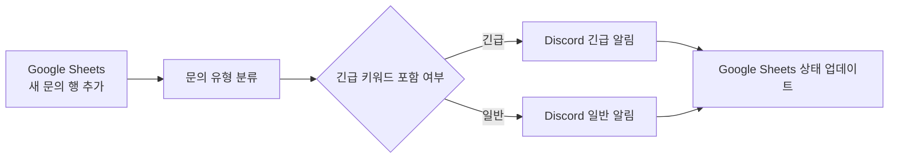
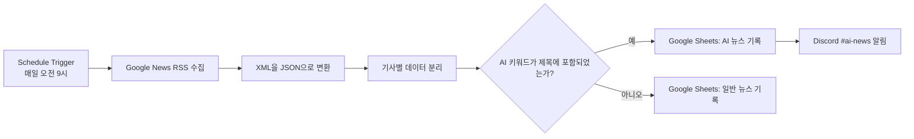

# 01. 프로젝트 정의

## 1. 과제 목표

본 과제의 목표는 반복 업무를 분석하여 자동화 가능한 흐름으로 설계하고, 서로 다른 노코드 자동화 도구를 비교·구현하는 것이다.

구체적으로 다음 역량을 확인한다.

- Trigger와 Action의 역할을 구분해 설명한다.
- 조건 분기(Filter, Router, If)의 기준을 설계한다.
- 서로 다른 자동화 도구의 특징을 비교한다.
- 업무 요구사항에 맞는 자동화 도구를 선택한다.
- 실제로 실행되는 자동화 워크플로우를 구현하고 결과를 검증한다.

---

## 2. 핵심 개념

### Trigger

Trigger는 자동화가 시작되는 사건 또는 조건이다.  
예를 들어 Google Sheets에 새 행이 추가되거나, 매일 오전 9시가 되는 상황이 Trigger가 될 수 있다.

즉, Trigger는 “언제 자동화를 시작할 것인가?”를 담당하는 시작점이다.

### Action

Action은 Trigger 발생 후 자동으로 수행되는 처리 작업이다.  
예를 들어 Discord 메시지 전송, Google Sheets에 행 추가, 상태 업데이트가 Action이다.

즉, Action은 “자동화가 시작된 뒤 무엇을 처리할 것인가?”를 담당한다.

### 조건 분기

조건 분기는 입력 데이터가 특정 기준을 만족하는지 확인한 뒤 서로 다른 경로로 처리하는 구조다.

예를 들어 문의 내용에 `긴급`이라는 단어가 있으면 긴급 알림을 보내고, 그렇지 않으면 일반 알림을 보내도록 설계할 수 있다. 조건 분기는 모든 데이터를 같은 방식으로 처리하지 않고, 업무 규칙에 맞게 구분하기 위해 필요하다.

---

## 3. 프로젝트 1: 자동화 도구 비교 구현

### 3-1. 자동화 대상 업무

Google Sheets에 고객 문의가 추가되면 문의 유형과 긴급도를 판별하여 Discord에 알림을 보내고, 처리 상태를 Google Sheets에 기록하는 업무를 자동화했다.

### 3-2. 사용 도구

- Make
- n8n
- Google Sheets
- Discord

### 3-3. 공통 워크플로우

### 3-4. 입력·처리·출력

| 구분 | 내용 |
|---|---|
| Trigger | Google Sheets에 새 고객 문의 행 추가 |
| 입력 데이터 | 문의 유형, 문의 내용, 이메일, 처리 상태 |
| 분기 기준 1 | 문의 유형: 결제 / 로그인 / 프로그램 / 기타 |
| 분기 기준 2 | 문의 내용에 긴급 키워드 포함 여부 |
| Action 1 | Discord 채널에 분류 결과 전송 |
| Action 2 | Google Sheets 처리 상태 업데이트 |
| 최종 출력 | 문의 유형과 긴급도에 맞는 알림 및 상태 기록 |

---

## 4. 프로젝트 2: AI 뉴스 자동 수집 및 분류

### 4-1. 자동화 대상 업무

매일 AI 및 IT 관련 뉴스를 직접 검색하고, AI 관련 기사만 따로 정리하여 공유하는 반복 업무를 자동화 대상으로 선정했다.

기존에는 뉴스 검색, 제목 확인, AI 관련 여부 판단, 스프레드시트 기록, Discord 공유를 수동으로 수행해야 했다. 이를 자동화하여 뉴스 탐색과 분류에 드는 반복 시간을 줄이고자 했다.

### 4-2. 선정 도구

프로젝트 2의 구현 도구는 **n8n**이다.

선정 이유는 다음과 같다.

1. Schedule Trigger로 매일 정해진 시간에 자동 실행할 수 있다.
2. HTTP Request와 XML 노드로 Google News RSS 데이터를 처리할 수 있다.
3. If 노드로 기사 제목의 AI 키워드 포함 여부를 분기할 수 있다.
4. Google Sheets와 Discord를 연결해 기록과 알림을 한 번에 처리할 수 있다.
5. 노드별 입력·출력을 확인할 수 있어 실행 결과 검증과 오류 확인이 편리하다.

### 4-3. 자동화 목표

매일 오전 9시에 Google News RSS에서 IT 뉴스를 수집하고, 제목에 AI 관련 키워드가 포함된 기사는 `AI 뉴스` 시트에 기록한 뒤 Discord `#ai-news` 채널에 알린다. 나머지 기사는 `일반 뉴스` 시트에 기록한다.

### 4-4. 프로젝트 2 워크플로우

### 4-5. 분기 기준

다음 키워드 중 하나라도 기사 제목에 포함되면 AI 뉴스로 분류했다.

- OpenAI
- 오픈AI
- ChatGPT
- 생성형 AI
- 생성형AI

AI 뉴스는 Google Sheets의 `AI 뉴스` 탭에 기록되고 Discord로 알림이 전송된다. 키워드가 없는 기사는 `일반 뉴스` 탭에 기록된다.
