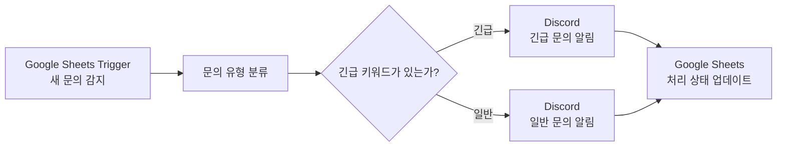
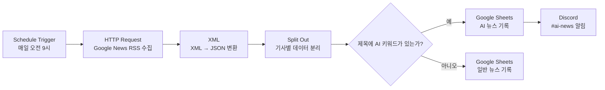

# 03. 워크플로우 설계

## 1. 설계 원칙

두 프로젝트는 다음 기준을 중심으로 설계했다.

1. **시작 조건을 명확히 정의한다.**  
   Trigger가 발생해야만 자동화가 시작되도록 구성한다.

2. **입력 데이터를 먼저 구조화한다.**  
   이후 분기와 Action에서 필요한 제목, 링크, 문의 내용 등의 데이터를 사용할 수 있도록 준비한다.

3. **분기 기준을 업무 규칙으로 작성한다.**  
   고객 문의는 긴급 키워드, 뉴스는 AI 키워드를 기준으로 분기한다.

4. **각 분기마다 결과가 남도록 설계한다.**  
   Google Sheets 기록과 Discord 알림을 통해 실행 결과를 확인할 수 있다.

---

## 2. 프로젝트 1 설계: 고객 문의 자동 분류

### 2-1. 워크플로우 구조



### 2-2. 단계별 설계

| 순서 | 단계 | 입력 | 처리 내용 | 출력 |
|---|---|---|---|---|
| 1 | Trigger | 새 문의 행 | Google Sheets의 새 행 감지 | 문의 데이터 |
| 2 | 유형 분류 | 문의 유형 | 결제, 로그인, 프로그램, 기타로 구분 | 유형별 경로 |
| 3 | 긴급 분기 | 문의 내용 | 긴급 키워드 포함 여부 판단 | 긴급/일반 경로 |
| 4 | Discord 알림 | 문의 정보 | 해당 채널에 메시지 전송 | 문의 알림 |
| 5 | 상태 업데이트 | 분류 결과 | 처리 상태 기록 | 업데이트된 행 |

### 2-3. 조건 분기 기준

긴급 여부는 문의 내용에 아래와 같은 표현이 포함됐는지로 판단했다.

```text
긴급 / 급 / 당장 / 빨리 / ASAP
```

이 기준은 고객 문의를 놓치지 않고 우선 처리하기 위한 업무 규칙이다.

### 2-4. 구현 화면

> 아래 이미지는 업로드 후 경로를 맞춰 연결한다.

```md


```


---

## 3. 프로젝트 2 설계: AI 뉴스 자동 수집

### 3-1. 워크플로우 구조



### 3-2. 단계별 설계

| 순서 | n8n 노드 | 입력 | 처리 내용 | 출력 |
|---|---|---|---|---|
| 1 | Schedule Trigger | 시간 조건 | 매일 오전 9시 자동 실행 | 워크플로우 시작 |
| 2 | HTTP Request | Google News RSS 주소 | IT 뉴스 RSS 요청 | XML 뉴스 데이터 |
| 3 | XML | XML 텍스트 | XML을 JSON으로 변환 | 구조화된 뉴스 목록 |
| 4 | Split Out | 뉴스 목록 | 기사를 한 건씩 분리 | 기사별 제목·링크·출처 |
| 5 | If | 기사 제목 | AI 키워드 포함 여부 판별 | True / False 분기 |
| 6-A | Google Sheets | AI 기사 | `AI 뉴스` 탭에 기록 | AI 뉴스 행 추가 |
| 7-A | Discord | AI 기사 | `#ai-news`에 알림 전송 | AI 뉴스 알림 |
| 6-B | Google Sheets | 일반 기사 | `일반 뉴스` 탭에 기록 | 일반 뉴스 행 추가 |

### 3-3. If 조건식

```javascript
/OpenAI|오픈AI|ChatGPT|생성형 AI|생성형AI/i.test($json["title"] || "")
```

이 조건식은 기사 제목에 AI 관련 키워드가 포함되면 `true`, 그렇지 않으면 `false`를 반환한다.

| 결과 | 처리 경로 |
|---|---|
| True | `AI 뉴스` 시트 기록 → Discord `#ai-news` 알림 |
| False | `일반 뉴스` 시트 기록 |

### 3-4. Google Sheets 기록 구조

두 시트는 동일한 열 구조를 사용한다.

| 수집일시 | 뉴스유형 | 제목 | 링크 | 출처 |
|---|---|---|---|---|
| 자동 기록 | AI 뉴스 또는 일반 IT 뉴스 | 기사 제목 | 기사 링크 | 언론사 |

### 3-5. 구현 화면

```md


```

---

## 4. 자동 실행 구조

프로젝트 2는 n8n에서 워크플로우를 **Published** 상태로 설정했다. 따라서 사용자가 직접 실행 버튼을 누르지 않아도 Schedule Trigger가 매일 오전 9시에 워크플로우를 시작한다.

자동 실행을 위해서는 다음 조건이 유지되어야 한다.

- n8n 실행 환경이 켜져 있어야 한다.
- Google Sheets와 Discord 연결 권한이 유지되어야 한다.
- Google News RSS 주소가 정상적으로 응답해야 한다.
